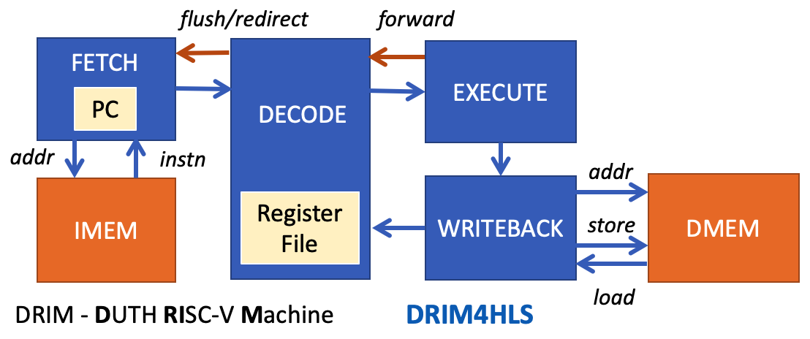

# DRIM4HLS: A 32-bit RISC-V processor designed for High Level Synthesis

DRIM4HLS is the first model of a 32b RISC-V processor designed with SystemC and [Matchlib's Connections](https://github.com/hlslibs/matchlib_connections "Connections"). The SystemC model is synthesized with High-level synthesis achieving an full-throughput pipeline dataflow. The baseline functionality of the processor is based on the [HL5 core](https://github.com/sld-columbia/hl5 "HL5") from Columbia University. DRIM4HLS was synthesized using Mentor's Catapult 2021 and verified with QuestaSim 2019.3_1. The RTL produced was also validated in an FPGA prototype using Xilinx Nexy 7 board.

The organization of the SystemC model of DRIM4HLS is shown in the following figure

The blue blocks are part of the processor while the instruction and data memories are used only for simulation. No specific latency is assumed by the memories. All blocks of the processor communicate using the Connections flow-controlled channels (ready/valid). In this way the stalling of instruction execution that naturally appears in all pipelined processors can be smoothly handled by the flow control mechanism inherent in the operation of Connections.

DRIM4HLS can be simulated using open-source libraries without requiring any other tools.

In the future the baseline pipelined processor will be enhanced with multiple architectural features such as branch prediction and caches that will improve its performance.

## Getting started

In order to simulate DRIM4HLS you would need gcc (testted on version 9.4) and SystemC (tested on version 2.3.3). You can download SystemC from [here](https://www.accellera.org/downloads/standards/systemc "SystemC download"). Also you would need the header-only libraries of [Connections](https://github.com/hlslibs/matchlib_connections "Connections download"), [AC_SIMUTILS](https://github.com/hlslibs/ac_simutils) and [AC_TYPES](https://github.com/hlslibs/ac_types). 

To synthesize the design to RTL you would need a license for Catapult HLS. Also for simulating RTL any logic-level simulator will suffice. We synthesized the processor with Catapult HLS 2021 and simulatd the RTL with QuestaSim 2019.3_1. 

The model of DRIM4HLS already incorporates all the pieces needed to run the post-synthesis SCVerify flow of Catapult for automatic RTL verification. 

## Compile

A `Makefile` is provided inside the project directory in order to easily compile DRIM4HLS. The Makefile uses the following variables:

* `HOME`
* `SYSTEMC_HOME`
* `AC_SIMUTILS_HOME`
* `AC_TYPES_HOME`

Change their values inside the Makefile to the ones corresponding to your environment. Then to compile the core run inside the home project directory.

    make

The compilation will create an executable with the name `sim_sc`.

## Simulating RISCV binaries

The repository contains a folder called `examples`, containing multiple small-scale programs for simulating the processor. In order to execute a testing program, a `.txt` file containing the instructions of the program must be passed to the executable `sim_sc`.

    cd examples/<program_name>
    ./sim_sc <program_name.txt>

The simulation of the core will produce two `.txt` files in the project directory. The `initial_dmem.txt` representing the memory of the core after loading the program and the `report_dmem.txt` representing the memory of the core after the execution of the testing program.

## Create your own testing programs

In order to generate your own testing programs from some C code, the [RISC-V GNU Compiler Toolchain](https://github.com/riscv-collab/riscv-gnu-toolchain "RISC-V GNU Compiler Toolchain download") is needed. The provided testing programs in the examples folder used the `8.2.0` version of the toolchain.

Clone the repository from the [above link](https://github.com/riscv-collab/riscv-gnu-toolchain "RISC-V GNU Compiler Toolchain download") and follow the instructions for downloading several standard packages needed to to build the toolchain.

### Installing the toolchain

The following commands will configure the toolchain and build it.

    ./configure --prefix=<custom_path> --enable-multilib
    make

Change `<custom_path>` to the desired location, for example `/opt/riscv`.

### Linker script and bootloader

Furthermore, a linker script, `lscript`, is needed (provided inside the examples folder) and a file, `bootloader`, with assembly code which calls the main() function (provided inside the examples folder).

### Compile C code

Before compiling the C code `riscv64-unknown-elf-gcc` must be in `$PATH`. In order to add it, run:

    export PATH=/<custom_path>/bin:$PATH

To compile some C code and create an object `ELF` file, run:

     riscv64-unknown-elf-gcc -O3 -march=rv32ima -mabi=ilp32 -T lscript  bootstrap.s notmain.c -o notmain.elf -nostdlib

### Create SREC file from ELF

SREC files conveys binary information as hex values. In order to create the file run:

     riscv64-unknown-elf-objcopy -O srec --gap-fill 0 notmain.elf notmain.srec

### Create TXT file form SREC

A `.txt` file containing the initial state of the core's memory (instructions and data) after the testing program is loaded is needed. This file will be passed as an argument to the core in order to start the simulation. To create the `.txt` from the `.srec` file, the `srec2text.py` script from [HL5](https://github.com/sld-columbia/hl5/blob/master/soft/srec2text.py "HL5 srec2txt.py") is used (also contained inside examples folder).

    ./srec2text.py notmain.srec > notmain.txt

Finally, the `notmain.txt` is reade and can be used to simulate the testing program on the core. 
