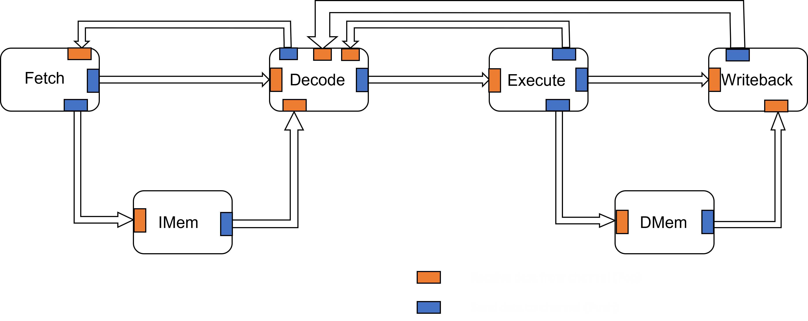

# DRIM4HLS: A 32-bit RISC-V processor designed with HLS

This is a high-level description in SystemC of an in-order 32-bit RISC-V core.
The processor is based on the [HL5 core](https://github.com/sld-columbia/hl5 "HL5") from Columbia university. It supports the "RV32IM", Base Integer Instruction Set (RV32I) with the Standard Extension for Integer Multiplication and Division (M). The core uses synthesizable latency-insensitive channels from the [Connections](https://github.com/hlslibs/matchlib_connections "Connections") hardware library for communication between different components. DRIM4HLS was synthesized using Mentor's Catapult 10.5a and verified with QuestaSim 2019.3_1.

|  |
|:--:|
| *Overview of DRIM4HLS core* |

## Getting started

### Tool versions

In order to simulate the core the following tools are needed.

* `gcc` - 9.4.0
* `systemc` - 2.3.3
* `connections` - 1.2.6

You can download SystemC from [here](https://www.accellera.org/downloads/standards/systemc "SystemC download") and Connections from [here](https://github.com/hlslibs/matchlib_connections "Connections download").

For synthesizing the core and verifying its functionality the additional tools are needed

* `catapult` - 10.5a
* `QuestaSim` - 2019.3_1

## Compiling

A `Makefile` is provided inside the project directory in order to easily compile the core. The Makefile uses the following variables:

* `HOME`
* `SYSTEMC_HOME`
* `PROJECT_DIR`

Change their values inside the Makefile to the ones corresponding to your workstation.

Then to compile the core run inside the home project directory.

    make

The compilation will create an executable with the name `sim_sc`.
## Simulation

The repository contains a folder called `examples`, containing four testing programs for simulating the core. In order to execute a testing program, a `.txt` file containing the instructions of the program must be passed to the executable `sim_sc`.

    cd examples/<program_name>
    ./sim_sc <program_name.txt>

The simulation of the core will produce two `.txt` files in the project directory. The `initial_dmem.txt` representing the memory of the core after loading the program and the `report_dmem.txt` representing the memory of the core after the execution of the testing program.

## Create your own testing programs
(COMING SOON)
